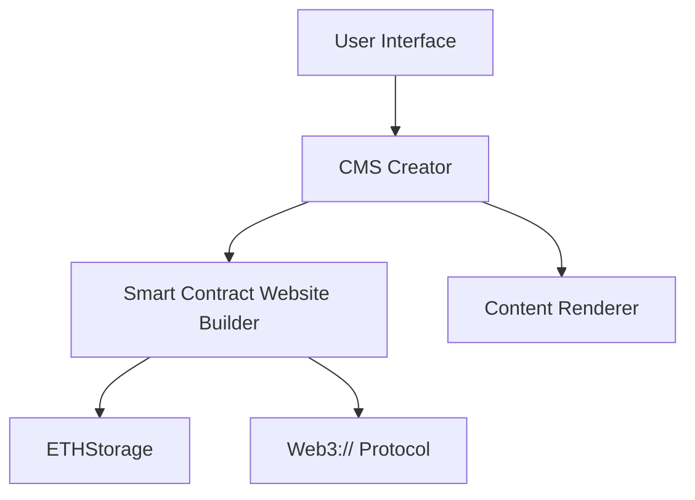

# Cypherpunk CMS


Cypherpunk CMS is a decentralized content management system created during EthSofia. The platform stores website components and content in smart contracts using ETHStorage and the **Web3://** standard (ERC-4804).

## Table of Contents

- [Features](#features)
- [Architecture](#architecture)
- [Getting Started](#getting-started)
- [Usage](#usage)
- [Contributing](#contributing)
- [License](#license)

## Features

- Decentralized storage of website components and content
- Utilizes ETHStorage for efficient and secure data storage
- Implements the Web3:// standard (ERC-4804) for seamless integration with Web3 technologies
- User-friendly interface for content management
- Customizable themes and layouts

## Architecture

The following diagram illustrates the high-level architecture of Cypherpunk CMS:



## Getting Started

1. Clone the repository:

   ```
   git clone repo
   ```

2. Install dependencies:

   ```
   npm install
   ```

3. Run the development server:

   ```
   npm run dev
   ```

4. Open your browser and navigate to `http://localhost:5137`.

## Usage


1. Connect wallet to the Cypherpunk CMS dashboard.
2. Create or edit pages using the visual editor.
3. Add components and content blocks to your pages.
4. Publish your changes to deploy them to the blockchain by signing transaction.

## Contributing

We welcome contributions to Cypherpunk CMS!

## License

Cypherpunk CMS is released under the MIT License.
